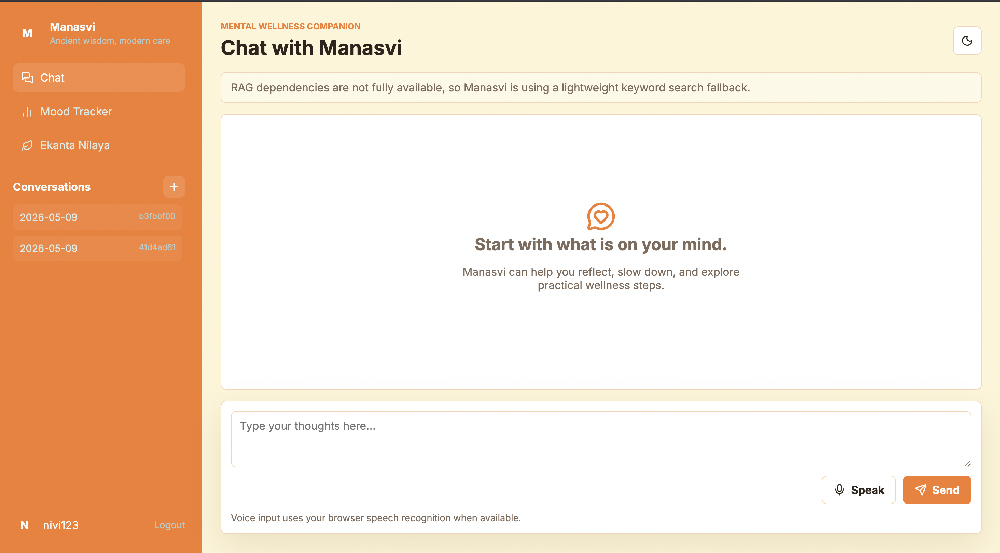
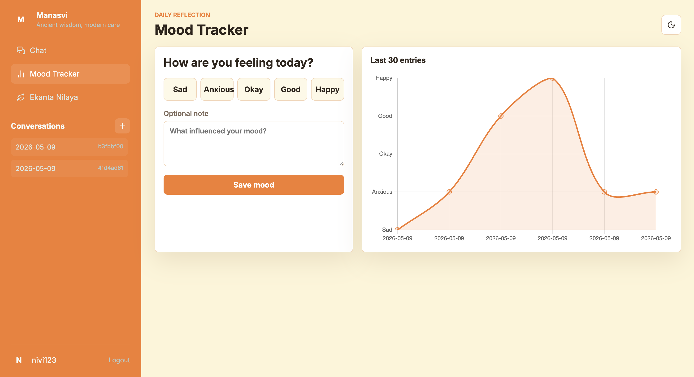
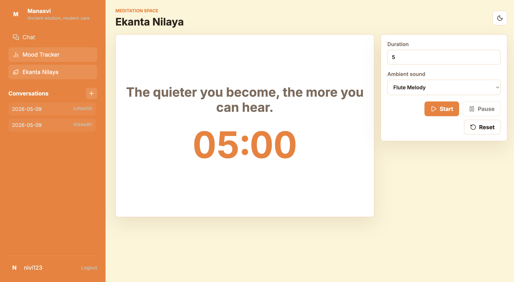

# Manasvi

Manasvi is a Flask-based mental wellness chatbot with culturally aware support, RAG-assisted responses, mood tracking, and a meditation timer with calming audio.

This project is intended for wellness support and reflection. It is not a replacement for medical care, therapy, crisis support, or emergency services.

## Features

- Account signup and login with hashed passwords
- AI chatbot powered by Groq's OpenAI-compatible chat API
- Retrieval-assisted prompts from a local wellness knowledge base
- Browser speech-to-text input for chat messages
- Server-backed mood tracker with a 30-entry trend chart
- Ekanta Nilaya meditation timer with flute, sitar, and violin audio
- Responsive shared UI, dark mode, and reusable templates

## Project Structure

```text
.
├── app.py                  # Flask entry point
├── manasvi/                # Application package
│   ├── app.py              # Routes and app factory
│   ├── config.py           # Environment-based configuration
│   ├── db.py               # SQLite setup and queries
│   ├── rag.py              # Knowledge-base retrieval
│   └── services.py         # Chatbot prompt and Groq integration
├── data/
│   └── knowledge_base.txt  # Local wellness knowledge base
├── static/
│   ├── css/styles.css
│   ├── js/app.js
│   └── *.mp3, img2.png
├── templates/              # Jinja templates
├── requirements.txt
└── .env.example
```

## Setup

1. Create and activate a virtual environment:

```bash
python3 -m venv .venv
source .venv/bin/activate
```

On Windows:

```bash
python -m venv .venv
.venv\Scripts\activate
```

2. Install dependencies:

```bash
pip install -r requirements.txt
```

For FAISS + Sentence Transformers retrieval, install the optional vector dependencies:

```bash
pip install -r requirements-vector.txt
```

3. Create local environment variables:

```bash
cp .env.example .env
```

Set `GROQ_API_KEY` in `.env`. For production, use a strong `FLASK_SECRET_KEY`.

4. Run the app:

```bash
python app.py
```

Open `http://127.0.0.1:8000`.

## Configuration

| Variable | Purpose | Default |
| --- | --- | --- |
| `FLASK_SECRET_KEY` | Flask session signing key | `dev-secret-change-me` |
| `GROQ_API_KEY` | Groq API key for chatbot responses | required for AI responses |
| `GROQ_MODEL` | Groq model name | `llama-3.3-70b-versatile` |
| `GROQ_API_URL` | OpenAI-compatible chat completions endpoint | Groq chat endpoint |
| `MANASVI_ENABLE_VECTOR_RAG` | Use FAISS + Sentence Transformers retrieval when set to `1` | `0` |
| `MANASVI_DB_PATH` | SQLite database path | `instance/manasvi.db` |
| `MANASVI_KB_PATH` | Knowledge base path | `data/knowledge_base.txt` |
| `FLASK_DEBUG` | Enable Flask debug mode with `1` | `0` |

## Notes

- Runtime files such as `.env`, `instance/`, and SQLite databases are ignored by Git.
- Keyword retrieval is enabled by default. Set `MANASVI_ENABLE_VECTOR_RAG=1` to use FAISS and Sentence Transformers.
- Browser voice input depends on the user's browser speech-recognition support.

## Safety

Manasvi includes a basic crisis-keyword response, but it cannot detect every emergency and cannot provide crisis intervention. Users who may be in immediate danger should contact local emergency services or a trusted person right away.

## Demo Images

| | |
|---|---|
|  |  |
|  | |

